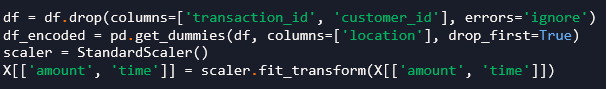
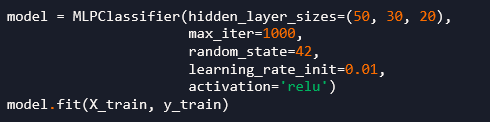
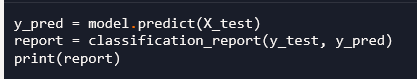
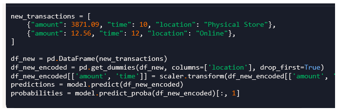
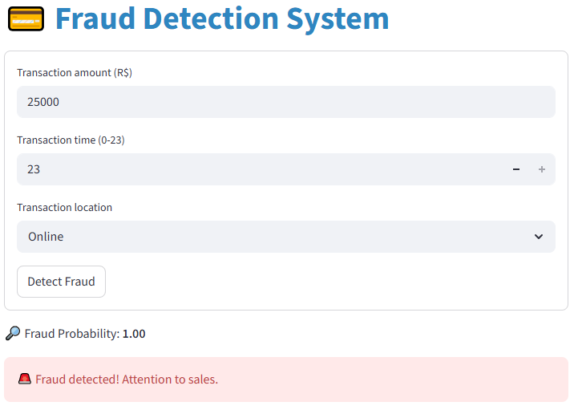
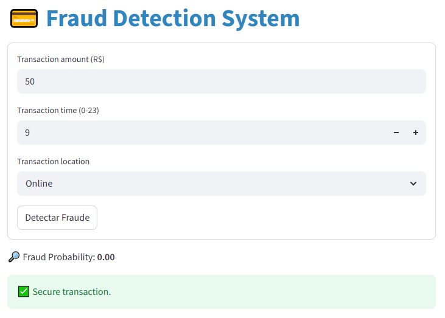
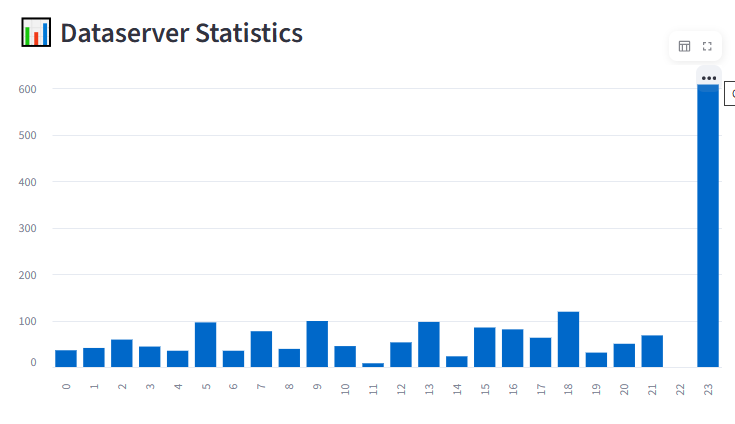
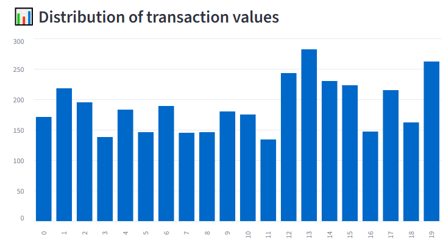
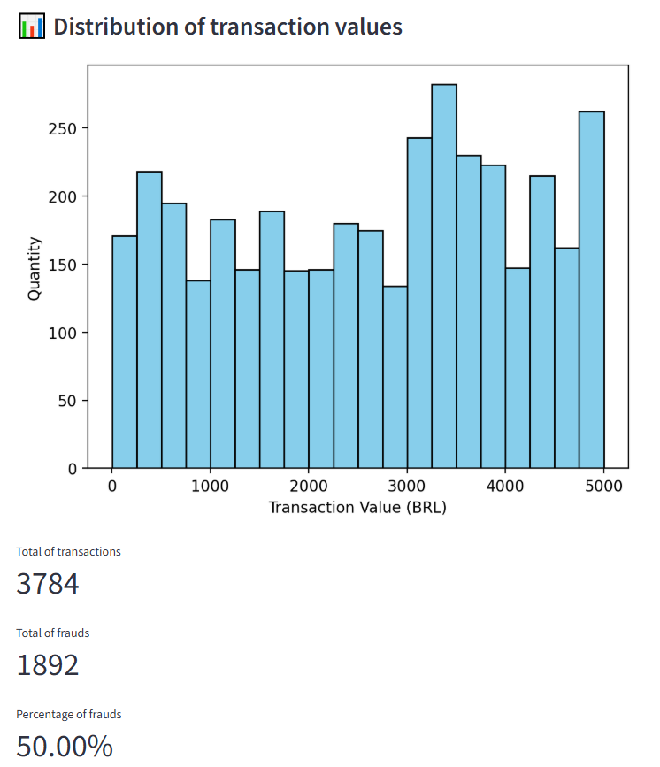

# smart_fraud_detector-

💳 Fraud Detection System
📑 Table of Contents
1. [Project Overview](#project-overview)  
2. [Dataset and Preprocessing](#dataset-and-preprocessing)  
3. [Model Training](#model-training)  
4. [Evaluation](#evaluation)  
5. [Prediction on New Data](#prediction-on-new-data)  
6. [Frontend with Streamlit](#frontend-with-streamlit)  
7. [How to Run](#how-to-run)  
8. [Future Improvements](#future-improvements)
9. [Screenshots](#screenshots) 

## Project Overview
This project implements a Machine Learning model for fraud detection in financial transactions. It uses a Neural Network (MLPClassifier) to classify whether a transaction is fraudulent or legitimate.
The project includes:
• 	Data preprocessing and balancing with SMOTE.
• 	Training and evaluation of a fraud detection model.
• 	Saving the trained model and scaler for reuse.
• 	A Streamlit frontend that allows users to input transaction details and receive real-time fraud predictions.
• 	Visualization of dataset statistics for better insights.

## Dataset and Preprocessing
Steps:
• 	Remove irrelevant columns: Transaction and customer IDs are dropped since they don’t carry semantic meaning.
• 	Add simulated fraud cases: High-value online transactions are artificially added to strengthen fraud detection.
• 	Encode categorical variables: The  column is transformed using one-hot encoding.
• 	Feature scaling: Numerical features (, ) are standardized using .
• 	Balance dataset: Fraud cases are often rare, so SMOTE (Synthetic Minority Oversampling Technique) is applied to balance the dataset.

## Reprocessing

## Model Training
• 	Algorithm:  (Multi-Layer Perceptron Neural Network).
• 	Architecture: Three hidden layers with sizes .
• 	Activation function: ReLU.
• 	Learning rate: 0.01.
• 	Iterations: Up to 1000.
The model is trained on the balanced dataset and saved as . The scaler is also saved as .
## Model Training

## Evaluation

## Prediction on New Data
The model can predict fraud probability for new transactions.

## Frontend with Streamlit
The frontend allows users to input transaction details and get fraud predictions in real time.

    
## How to Run
1. 	Clone the repository:
git clone https://github.com/yourusername/smart_fraud_detector.git
cd smart_fraud_detector

2. 	Install dependencies:
pip install -r requirements.txt

3. 	Run the Streamlit app:
streamlit run app.py

## Future Improvements
• 	Add more features (e.g., device type, transaction frequency).
• 	Deploy the model with Docker or cloud services.
• 	Improve frontend with interactive dashboards.

## Screenshots
### Fraud Detection Form

### Secure Transation Form

### Dataserver Statistics

### Distribution of transaction values

### Distribution of transaction values

